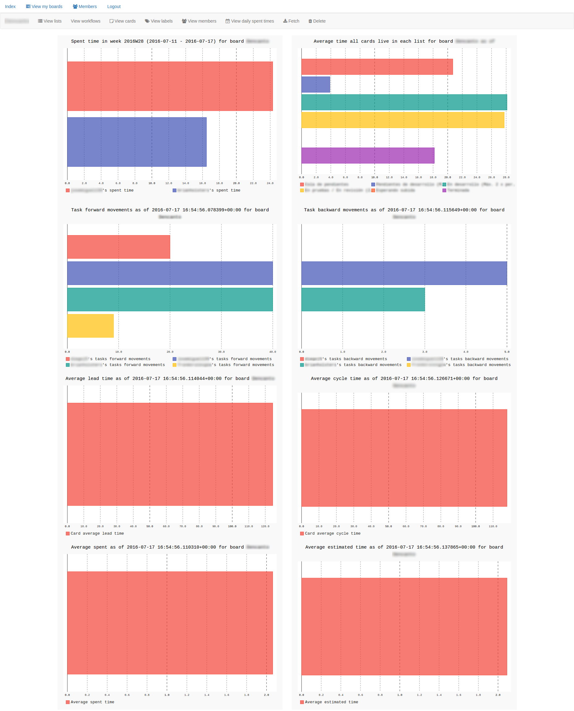
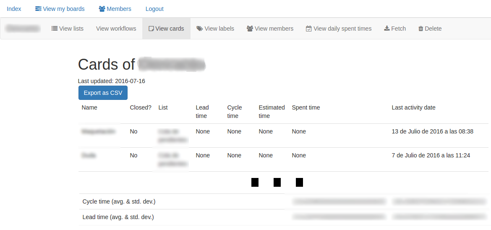
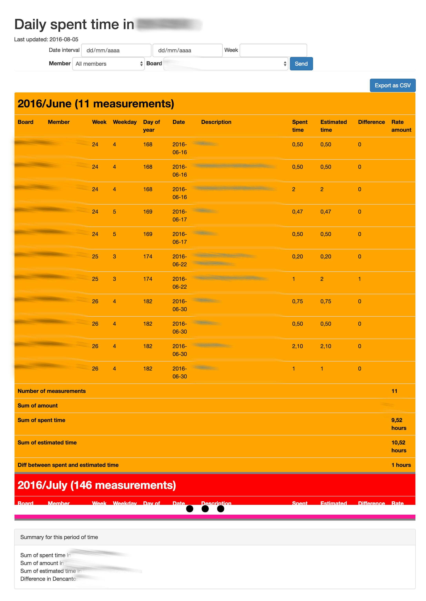

# Django Trello stats

Statistics and charts for Trello boards, now in a Django app.

# Requirements

## Plus for Trello

Use [Plus for Trello](https://chrome.google.com/webstore/detail/plus-for-trello-time-trac/gjjpophepkbhejnglcmkdnncmaanojkf?hl=en)
in your boards to allow this application to get card spent and estimated times.

## Installation

Django, python-mysql and more packages specified in **requirements.txt**.

# Configuration

## Local settings

Copy this code and create a settings_local.py file in your server in **src**.

Write your database credentials and your domain. Switch off debug messages.

I've used MySQL as a database but you can use whatever you want.

```python
# -*- coding: utf-8 -*-

# SECURITY WARNING: keep the secret key used in production secret!
SECRET_KEY = '<whatever string you want>'

# SECURITY WARNING: don't run with debug turned on in production!
DEBUG = True

DOMAIN = "<your domain>"
ALLOWED_HOSTS = [DOMAIN]

DATABASES = {
    'default': {
        'ENGINE': 'django.db.backends.mysql',
        'NAME': '<database name>',
        'USER': '<user>',
        'PASSWORD': '<password>',
        'HOST': '',
        'PORT': ''
    }
}
```

## Sign up

First you need to sign up with the api key, token and token secret.

This action will create a new user in the system.

User your email to log in the application.


## Initialize boards and lists

Later, you need to initialize the boards.

Use this command:

```python
python src/manage.py init <trello_username>
```

This initialization is only done for boards that are not initialized.

So, if you create a new board, execute the command again without fear of losing data.

## Set up boards

Setting up which lists of the board are the "development" and "done" lists.

Thus, the rest of the lists must be positioned before or after the development lists.


## Fetch cards

And of course, you have to fetch the cards.

```python
python src/manage.py fetch <trello_username>
```

One good idea is set this action in a cron action and call it each day.

If you want to call this action, there is a button that allows you to fetch all the board data:


And that's all, then you have several interfaces with data about members, labels, cards and daily spent times

# Interfaces

## Board view



## Board cards



## Board labels


## Board members


## Board spent times



# TODO

There are some features that are not completed. For example, workflows.

Workflows are a feature that will allow you to define what lists have to be
considered to measure spent, estimated and card living times.

Workflow stats are not completed. Only the definition of workflows is fully implemented but not their stats.


# Questions? Suggestions?

Don't hesitate to contact me, write me to diegojREMOVETHISromeroREMOVETHISlopez@REMOVETHISgmail.REMOVETHIScom.

(remove REMOVETHIS to see the real email address)